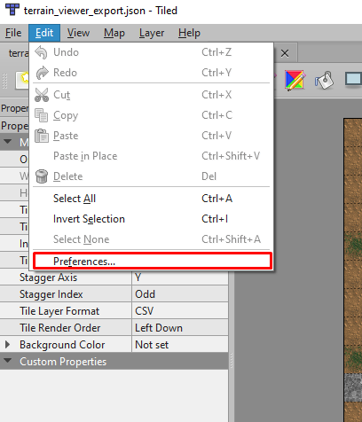
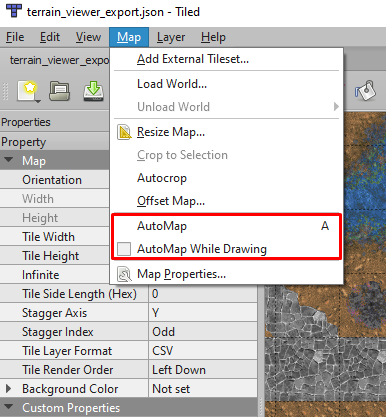
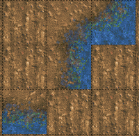
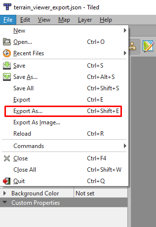
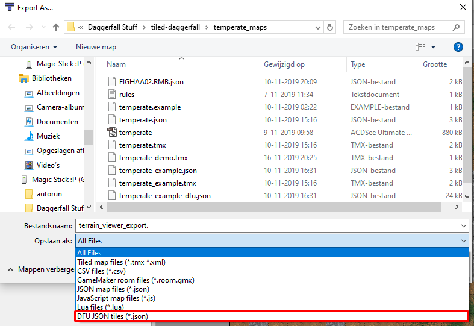

# tiled-daggerfall-terrain-automap
Basic setup to use Daggerfall terrain textures with [Tiled](https://www.mapeditor.org/)'s automapping feature

## Introduction

This is a collection of files to aid with the creation and editing of new and existing Daggerfall terrain layouts using Tiled's automapping features.

## Setup

1. Download and install [Tiled 1.2.5](https://www.mapeditor.org/)
2. Download the additional zip file and extract it to the `textures` folder, you should see the following:
	- TEXTURE.002_DesertTest
    - TEXTURE.102_Mountain
    - TEXTURE.302_Temperate
    - TEXTURE.402_Swamp
3. Copy the `.tiled` folder from the project to your operating system's User folder.

**ATTENTION WINDOWS USERS**

On Windows, Tiled's Python scripting is disabled by default. In order to activate Python scripting for Tiled, go the following link for [Python 3.7.5 releases](https://www.python.org/downloads/release/python-375/#windows-users) and download the Python version for the correct architecture (see below).

**NOTE: Please ignore the NOTE section at the top of the download page that urges you to download the latest Python version. Just download the appropriate file to install 3.7.5**

- For Tiled's 64-bit version download the `Windows X86-64` version.
- For Tiled's 32-bit version, download the `Windows X86` version.

Close Tiled, follow Python's installation instructions and make sure to add Python to the `Environment Variables` when prompted, otherwise Tiled won't detect the installation. After Python has been successfully installed, relaunch Tiled and go to `Edit > Preferences`:

A new window will appear with several tabs, select the `Plugins` tab and check for the Python plugin in the list:

Make sure the box next to `python.dll` is ticked. If there is something wrong, the plugin will display a Stop-sign instead of the tickbox. If the box is already ticked, you're good to go.

## Usage

Daggerfall has 4 types of terrain: *desert*, *mountain*, *swamp* and *temperate*. This projects contains corresponding folders that have been set up to use Tiled's automapping features.

The folders follow this naming pattern: `<terrain\>_maps` and have two files in them:

1. **rules.txt**
2. **<terrain\>\.tmx**

The `rules.txt` is used by Tiled to load the files used for automapping. You can read more about it here: [Tiled Automapping](https://doc.mapeditor.org/en/stable/manual/automapping/)
 
The `<terrain>.tmx` file is a template that is configured to use the correct tileset and has the correct dimensions (16x16 tiles). It contains a single layer named `terrain`. The files referenced in the rules.txt need that layer to exist in order to take effect.

If you want to create a new terrain, you can make a copy of this file and give it a new name or if you're familiar with Tiled, just load in the tileset (`<terrain>.tsx`) you want to use, create a new map and then save it to the appropriate `<terrain>_maps` folder. If you do create a new map, do **NOT** forget to rename the layer to `terrain`.

### Using AutoMapping

When using a tileset in Tiled that has rules defined for automapping, there are two ways you can use it. See the screenshot below on how to access these:

1. **AutoMap**: Apply manually by pressing A when you are placing tiles. This will tell Tiled to check the current maptiles against the automapping rules and it will replace any pattern matched.
2. **AutoMap While Drawing**: Tick the 'AutoMap While Drawing' box and Tiled will automically check the current map tiles against the automapping rules and again replace any pattern matched.

Automapping might interfere with specific layouts you want to make because the rules find a different match than what you're trying to create. If this happens, disable `Automap While Drawing` if active or do not press A while you are creating the layout you want. After the layout has been made, it's usually okay to press A again and map out other parts of your map.

### Creating a map

1. Decide the type of terrain to use
2. Go to the corresponding `<terrain>_maps` folder
3. Make a copy of the `<terrain>.tmx` file in that folder or create a new map file from Tiled directly that uses the correct tileset and save it to the `<terrain>_maps` folder.

### Prepare a map for AutoMapping

If you made a copy of the `<terrain>.tmx` file, you can skip this preparation. 

If you decided to create a new map file, use the flood fill (paint bucket) the 55th tile in the tileset. This is the farmland-tile which is rarely used for terrains so I have used this tile in the automapping rules as a filler tile. This means that the automapping rules will only replace matches patterns if they contain this farmland tile.

### Automap Example

I'm keeping this example simple on purpose. The best way to get a feel for Automapping is to activate the `AutoMap While Drawing` feature and start placing tiles on the map.

- **Bottom-left: 6-0 (rotated)**
- **Middle: 6-0**
- **Top-right: 5-0**

Pressing A once with the tiles set up like the example above will add tile **7-0** to the top-middle to connect the top-right and the middle tile.

Check out the result below:

Pressing A again with the additional tile **7-0** in place will add tile **5-0** to the bottom-middle 

With `AutoMap While Drawing` enabled, the above examples would be filled out automatically instead of having to hit 'A' manually each time.

## Importing from Daggerfall Unity

## Exporting to Daggerfall Unity format

Start Tiled, open your map and choose `File > Export As`

You will get a file dialog window, in the `Save as` section, select `DFU JSON tiles (*.json)` instead of `All Files`

Choose your filename and hit `Save`. This will create a JSON file that has a list of tile objects that you can copy and paste into your `.RMB.json` file that you got from Daggerfall Unity.

## Technical details

### Automapping setup

#### Root folder

In the root folder of the project, you will find several `.TSX` files, these are the tilesets that are used in Tiled to paint the terrain. You will also find several `.TMX` files that follow a certain filename pattern: 

- <terrain\>\_dirt.tmx
- <terrain\>\_grass.tmx
- <terrain\>\_rock.tmx
- <terrain\>\_water.tmx

These `.TMX` files contain the patterns that are recognised by the Automapping function. You can open these files in Tiled to see how the patterns are defined. By hiding the layers named `regions_input` and `regions_output` you can see the input and output. By hiding the `output_terrain` layer, you can see the expected input pattern by itself. 

#### <terrain\>\_maps folders

The `<terrain>_maps` folders all have a file named `rules.txt`. This is the file that allows Tiled to apply the `.TMX` files mentioned in the previous section as automapping rules. It simply contains the paths to the appropriate `.TMX` files that define the automapping patterns.